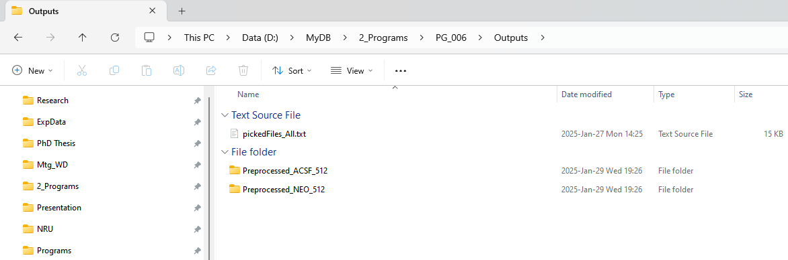
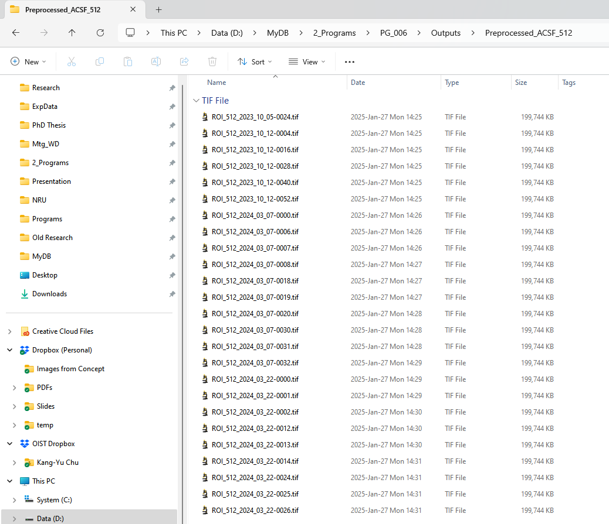
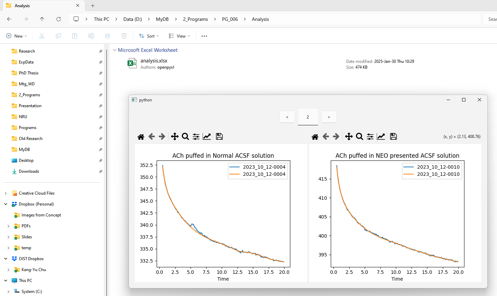
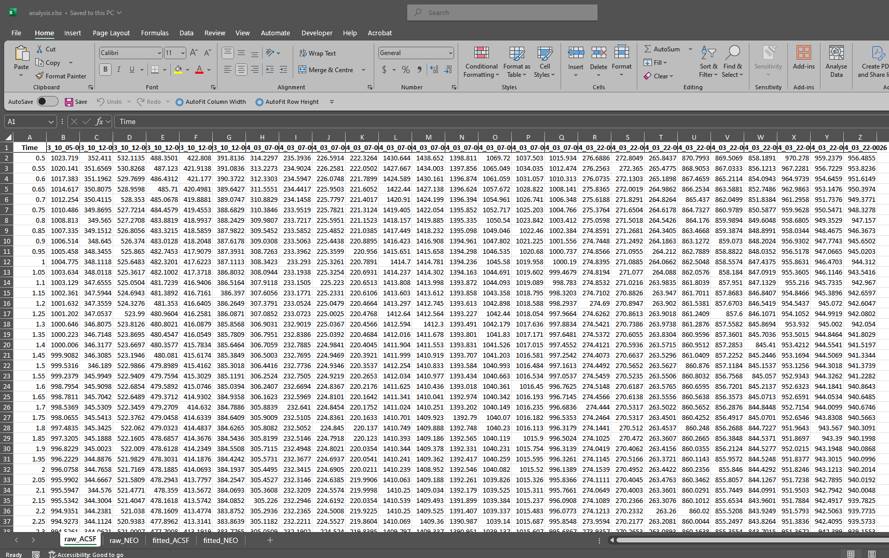
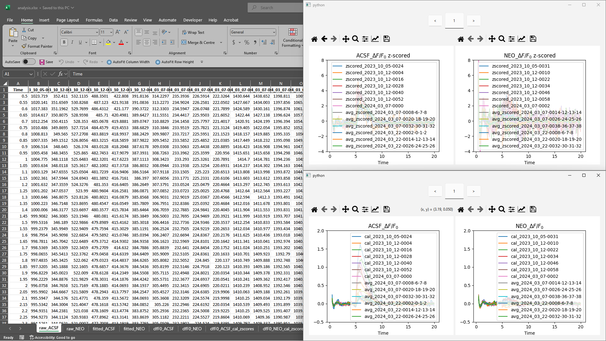
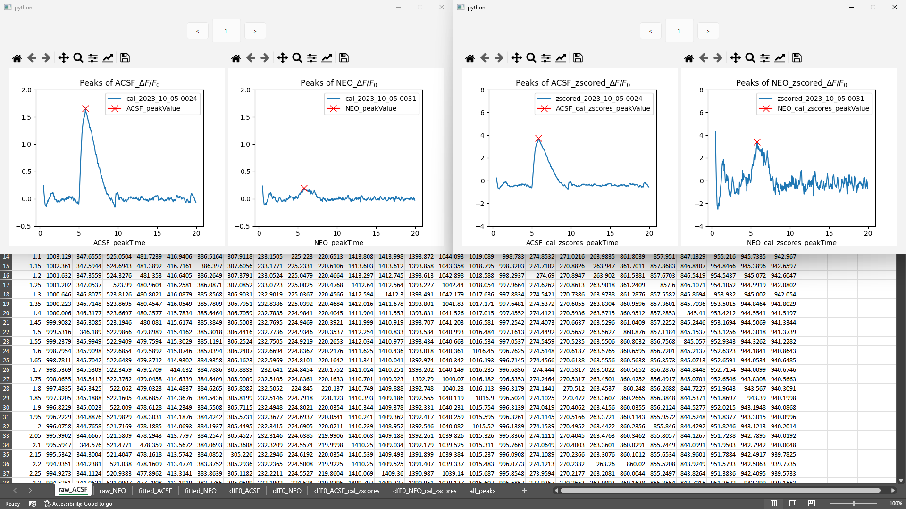

# OUTPUT
Step 1: Preprocessing
This program read the summary csv files to filter out the raw data fit the conditions of analysis, and then truncate and crop the image for calculating the average intensity of each frames so that to find the $\Delta F/F_0$  and the peaks. Below is an example of use ROI size = 512x512, frames = 390, Conditions are Puff Count 1 time, Puff Period = 30 ms

After preprocessing, the step_02 program will flatten each frame of image of each file to produce one dimensional time-series data for further analysis. The fitting model used in this program is $\beta$-Spline interpolation. The results will be shown in a simple python GUI and be saved in an excel file.

Next, the step_03 uses the data in the excel file calculate $\Delta F/F_0$ and z-scored $\Delta F/F_0$. Similarly, the processed results will be appended to the same excel file.

Lastly, the step_04 find out the peak values of $\Delta F/F_0$ and zscored $\Delta F/F_0$ curves,

# MEMO
- The "Output" folder is too huge to upload.
- All parameters except for time (start from 0 is changed to start from 0.5) are the same to the old programs.

